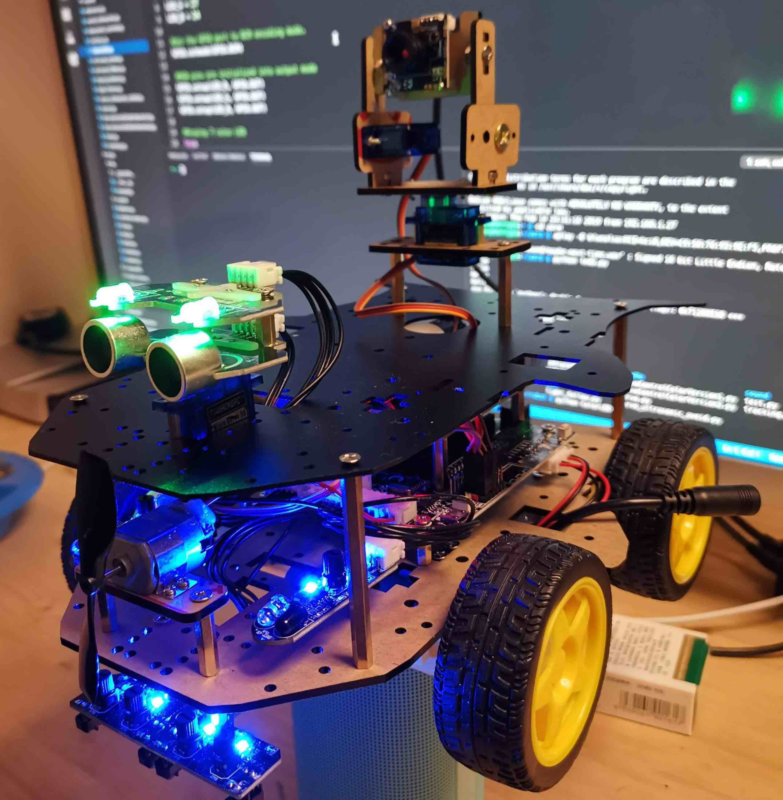

# robotoy

Play with my Yahboom robot!

## Setup Raspberry Pi

-   Install python3
-   Install GPIO packages
    -   python-gpiozero
    -   ...

## Run Test

-   python3 -m robotoy.tests.test-car

